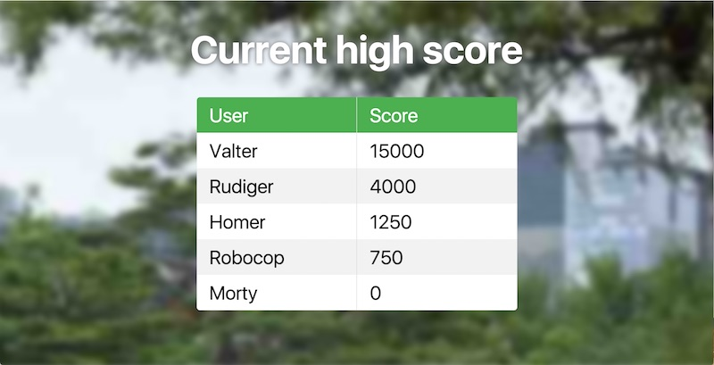

# High score (Authentication)

[View Demo](https://valterkraemer.github.io/mavo-couchdb/examples/authentication/)

This example show a high score list where you have to log in to be able to edit it.

*User: valter pass: valter*

The browser will probably block sign-in popup so you have to allow popups for domain.

# Known issues

#### Forbidden even if logged in.

Reason: The browser is not setting CouchDB's authorization cookie when the browser has a strict cookie policy.
